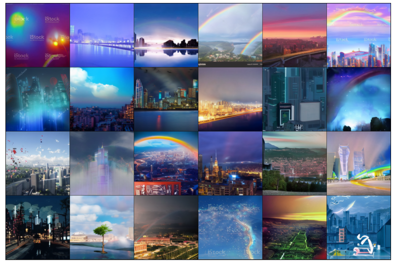
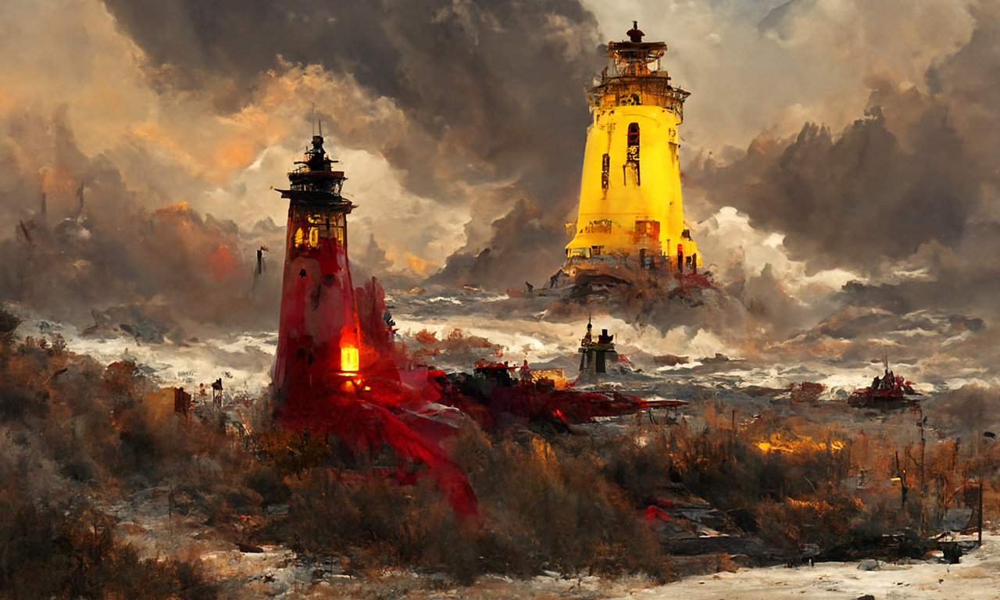
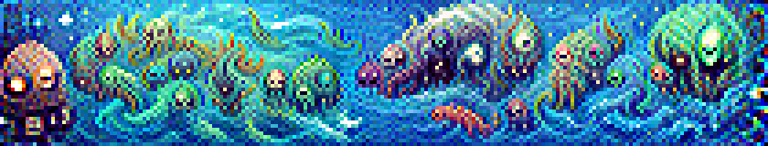
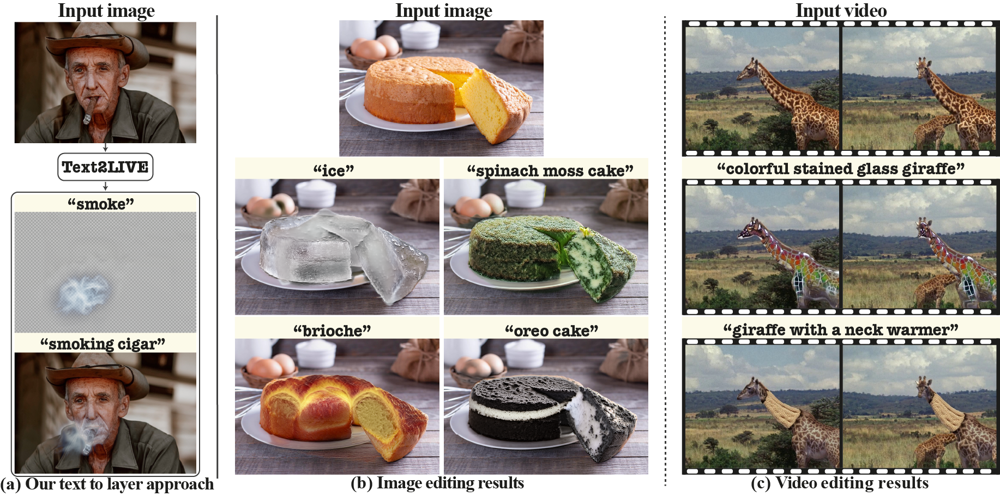

# AiArt

# Text generation

### [ruGPT](https://github.com/ai-forever/ru-gpts)
Большая русскоязычная модель для генерации картинки по тексту

 

# Image generation

### [ruDAll-E](https://github.com/ai-forever/ru-dalle)
Большая русскоязычная модель для генерации картинки по тексту
 

### [Disco Diffusion Image generation](https://github.com/NightmareAI/disco-diffusion-1)
 
Один из самых полных репозиториев по теме Disco Diffusion для генерации картинок по тексту

### [Pixray image generation](https://github.com/pixray/pixray)
Генерация пиксельных генераций с помошью GAN + CLIP
 

### [Stable diffusion](https://github.com/CompVis/stable-diffusion) 
Генерация реалистичеых изображений с помощью диффузии
 

### [StackMix](https://github.com/ai-forever/StackMix-OCR)
Генерация текста определенным подчерком

# Video generation
### [CogVideo](https://github.com/THUDM/CogVideo)
Генерация видео с помощью трансформера

https://user-images.githubusercontent.com/48993524/170857367-2033c514-3c9f-4297-876f-2468592a254b.mp4

### [Apple Video ml-neuman](https://github.com/apple/ml-neuman)
анимация людей с помощью двух NERF

  

### [Text2live](https://github.com/omerbt/Text2LIVE)
Иземенение фото и видео с помощью CLIP и vqgan

  

# Music generation
### [ Music Composer ](https://github.com/ai-forever/music-composer)
Генерация музыки с помощью трансформера

# Superresolution
### [ ESRGAN ](https://github.com/ai-forever/Real-ESRGAN)
Увелчение разрешния изображения с помощью GAN

